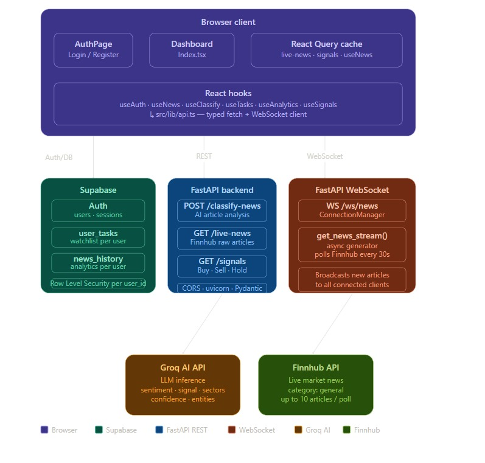
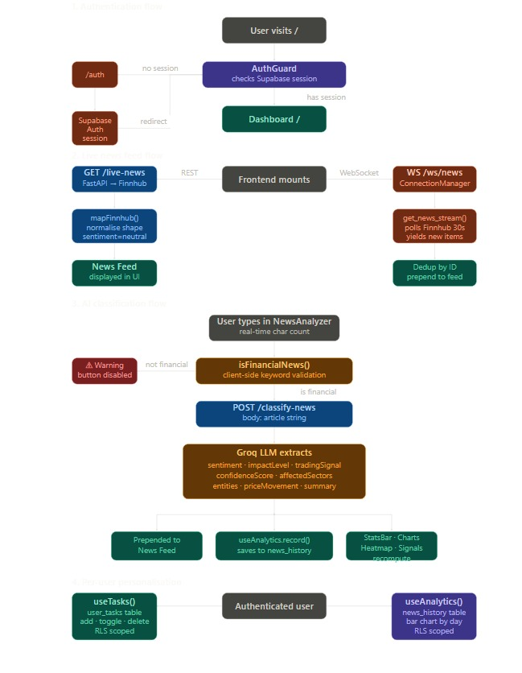

# Financial News Classifier Agent — AI-Powered Financial News Intelligence Platform

<div align="center">


[](https://fastapi.tiangolo.com/)
[](https://react.dev/)
[](https://www.typescriptlang.org/)
[](https://supabase.com/)
[](https://groq.com/)

**A real-time, multi-user financial news classification and trading intelligence platform powered by Groq AI, Finnhub, FastAPI, and Supabase.**

</div>

---

## Table of Contents

- [Overview](#overview)
- [System Architecture](#system-architecture)
- [Data Flow & Workflow](#data-flow--workflow)
- [Features](#features)
- [Tech Stack](#tech-stack)
- [Project Structure](#project-structure)
- [Getting Started](#getting-started)
- [Environment Variables](#environment-variables)
- [API Reference](#api-reference)
- [Database Schema](#database-schema)
- [Known Limitations](#known-limitations)

---

## Overview

Financial News Classifier Agent is a full-stack financial intelligence platform that:

1. **Streams live market news** from Finnhub via REST polling and WebSocket
2. **Classifies news articles** using a Groq-powered AI agent — extracting sentiment, impact level, trading signals, affected sectors, and confidence scores
3. **Personalizes the experience per user** — each user has their own watchlist/task panel and a private classification history with analytics
4. **Restricts classification** to financial news only — non-financial text is blocked client-side before the API is ever called
5. **Visualizes market sentiment** in real time through charts, heatmaps, and signal panels

---

## System Architecture



---

## Data Flow & Workflow


---

## Features

| Feature | Description |
|---|---|
| 🔐 **Multi-user Auth** | Supabase email/password auth with protected routes |
| 📰 **Live News Feed** | Finnhub REST polling (60s) + WebSocket streaming (30s) |
| 🤖 **AI Classification** | Groq LLM extracts sentiment, signals, sectors, confidence |
| 🚫 **Financial-only Guard** | Client-side keyword validation blocks non-financial text |
| 📋 **Per-user Watchlist** | Ticker-tagged tasks stored in Supabase with RLS |
| 📊 **Personal Analytics** | Historical classification chart scoped per user |
| 📡 **Real-time WebSocket** | Live news pushed to all connected browser tabs |
| 🗺️ **Sector Heatmap** | Visual bullish/bearish breakdown by market sector |
| 🎯 **Trading Signals** | Buy/Sell/Hold signals from classified news |
| 🌗 **Connection Status** | Live indicator: LIVE / REST ONLY / LOADING |

---

## Tech Stack

### Frontend
| Tool | Purpose |
|---|---|
| React 18 + TypeScript | UI framework |
| Vite | Build tool & dev server |
| Tailwind CSS | Utility-first styling |
| TanStack React Query | Server state, caching, refetching |
| React Router v6 | Client-side routing + auth guards |
| Recharts | Sentiment pie chart, analytics bar chart |
| Supabase JS Client | Auth session, DB reads/writes |
| Sonner | Toast notifications |
| Lucide React | Icons |
| date-fns | Date formatting |

### Backend
| Tool | Purpose |
|---|---|
| FastAPI | REST API + WebSocket server |
| Uvicorn | ASGI server |
| Groq SDK | LLM inference for classification |
| Finnhub API | Live market news source |
| yfinance | Price data for signal accuracy |
| SQLAlchemy | ORM (impact tracking) |
| python-dotenv | Environment variable management |
| websockets | WebSocket protocol support |

### Infrastructure
| Tool | Purpose |
|---|---|
| Supabase | Auth, PostgreSQL DB, Row Level Security |
| Finnhub | Financial news data source |
| Groq | Ultra-fast LLM inference |

---

## Project Structure

```
Financial News Classifier Agent/
│
├── Backend/                          # FastAPI Python backend
│   ├── app/
│   │   ├── main.py                   # App entry, CORS, router registration
│   │   ├── models/
│   │   │   └── prediction_model.py   # ML prediction model
│   │   ├── routes/
│   │   │   ├── classify.py           # POST /classify-news
│   │   │   ├── news.py               # GET /live-news
│   │   │   ├── signals.py            # GET /signals, GET /accuracy/{ticker}/{signal}
│   │   │   └── websocket.py          # WebSocket /ws/news
│   │   └── services/
│   │       ├── groq_service.py       # Groq LLM classification logic
│   │       ├── impact_tracker.py     # Signal accuracy tracking
│   │       └── news_stream_service.py# Finnhub REST + async WS generator
│   └── requirements.txt
│
├── src/                              # React + TypeScript frontend
│   ├── components/
│   │   ├── AnalyticsPanel.tsx        # Per-user history chart
│   │   ├── NewsAnalyzer.tsx          # AI classifier input (financial-only)
│   │   ├── NewsCard.tsx              # Individual news article card
│   │   ├── SectorHeatmap.tsx         # Market sector sentiment grid
│   │   ├── SentimentChart.tsx        # Bullish/bearish/neutral pie chart
│   │   ├── StatsBar.tsx              # Top-level stats (articles, signals, etc.)
│   │   ├── TaskPanel.tsx             # Per-user watchlist/tasks
│   │   └── TradingSignals.tsx        # Buy/Sell/Hold signal list
│   ├── hooks/
│   │   ├── useAuth.ts                # Supabase auth state + actions
│   │   ├── useAnalytics.ts           # Per-user classification history
│   │   ├── useClassify.ts            # POST /classify-news mutation + validation
│   │   ├── useNews.ts                # GET /live-news + WebSocket stream
│   │   ├── useSignals.ts             # GET /signals query
│   │   └── useTasks.ts               # Per-user task CRUD (Supabase)
│   ├── lib/
│   │   ├── api.ts                    # Typed API client (fetch wrapper + WS)
│   │   ├── types.ts                  # Shared TypeScript types
│   │   └── utils.ts                  # Utility functions
│   ├── pages/
│   │   ├── AuthPage.tsx              # Login / Register screen
│   │   ├── Index.tsx                 # Main dashboard
│   │   └── NotFound.tsx              # 404 page
│   ├── integrations/supabase/
│   │   └── client.ts                 # Supabase client singleton
│   ├── App.tsx                       # Router + Auth/Public guards
│   └── main.tsx                      # React entry point
│
├── supabase_schema.sql               # DB tables + RLS policies
├── .env                              # Frontend env vars (gitignored)
└── README.md
```

---

## Getting Started

### Prerequisites

- Node.js 18+ and npm/bun
- Python 3.10+
- A [Supabase](https://supabase.com) project
- A [Groq](https://console.groq.com) API key
- A [Finnhub](https://finnhub.io) API key (free tier)

### 1. Clone the repository

```bash
git clone https://github.com/your-username/finpulse.git
cd finpulse
```

### 2. Set up the database

Go to your **Supabase project → SQL Editor** and run the contents of `supabase_schema.sql`.

Then go to **Supabase → Authentication → Providers → Email** and disable **"Confirm email"** for local development (re-enable it in production).

### 3. Configure environment variables

Create a `.env` file in the project root:

```env
VITE_API_URL=http://localhost:8000
VITE_WS_URL=ws://localhost:8000
```

Your Supabase URL and anon key should already be in `src/integrations/supabase/client.ts`.

Create `Backend/.env`:

```env
GROQ_API_KEY=your_groq_api_key_here
FINNHUB_API_KEY=your_finnhub_api_key_here
```

### 4. Start the backend

```bash
cd Backend
pip install -r requirements.txt
uvicorn app.main:app --reload
```

Backend runs at `http://localhost:8000`. Visit it to confirm:

```json
{ "message": "Financial News Classifier API Running" }
```

### 5. Start the frontend

```bash
# From project root
npm install      # or: bun install
npm run dev      # or: bun dev
```

Frontend runs at `http://localhost:8080` (or `5173` depending on Vite config).

### 6. Register and log in

Navigate to `http://localhost:8080` → you'll be redirected to `/auth`. Register an account, then sign in.

---

## Environment Variables

### Frontend (`.env` in project root)

| Variable | Description | Default |
|---|---|---|
| `VITE_API_URL` | FastAPI backend base URL | `http://localhost:8000` |
| `VITE_WS_URL` | WebSocket base URL | `ws://localhost:8000` |

### Backend (`Backend/.env`)

| Variable | Description |
|---|---|
| `GROQ_API_KEY` | Your Groq API key from console.groq.com |
| `FINNHUB_API_KEY` | Your Finnhub API key from finnhub.io |

---

## API Reference

### `POST /classify-news`

Classifies a financial news article using the Groq AI agent.

**Request body:**
```json
{ "article": "Fed raises interest rates by 25 basis points amid inflation concerns" }
```

**Response:**
```json
{
  "id": "uuid",
  "title": "Fed raises interest rates...",
  "summary": "The Federal Reserve increased rates...",
  "sentiment": "bearish",
  "impactLevel": "high",
  "tradingSignal": "sell",
  "confidenceScore": 0.87,
  "affectedSectors": ["Financials", "Real Estate"],
  "entities": ["Federal Reserve", "USD"],
  "priceMovement": "-1.2% expected",
  "source": "User Input",
  "publishedAt": "2024-01-15T10:30:00Z"
}
```

### `GET /live-news`

Returns up to 5 latest articles from Finnhub. Returns `[]` on rate-limit or network error.

### `GET /signals`

Returns current trading signals.

```json
{ "signals": [{ "asset": "AAPL", "signal": "BUY", "confidence": 87 }] }
```

### `GET /accuracy/{ticker}/{signal}`

Returns historical accuracy for a given ticker + signal pair.

### `WebSocket /ws/news`

Connect to receive live news articles as JSON. New articles are pushed every time `get_news_stream()` yields a new unseen item (polls Finnhub every 30s).

---

## Database Schema

### `user_tasks`

| Column | Type | Description |
|---|---|---|
| `id` | uuid | Primary key |
| `user_id` | uuid | References `auth.users` |
| `title` | text | Task description |
| `ticker` | text | Optional ticker symbol (e.g. AAPL) |
| `note` | text | Optional note |
| `done` | boolean | Completion state |
| `created_at` | timestamptz | Creation timestamp |

RLS: users can only read/write their own rows.

### `news_history`

| Column | Type | Description |
|---|---|---|
| `id` | uuid | Primary key |
| `user_id` | uuid | References `auth.users` |
| `title` | text | Article headline |
| `sentiment` | text | `bullish` / `bearish` / `neutral` |
| `impact_level` | text | `high` / `medium` / `low` |
| `trading_signal` | text | `buy` / `sell` / `hold` |
| `confidence_score` | float | 0.0 – 1.0 |
| `affected_sectors` | text[] | List of market sectors |
| `source` | text | News source |
| `classified_at` | timestamptz | When the user classified it |

RLS: users can only read/write their own rows.

---

## Known Limitations

| Issue | Detail |
|---|---|
| **Finnhub free tier rate limits** | The free plan allows ~60 calls/min. During high traffic the `/live-news` endpoint returns `[]` gracefully instead of crashing. Upgrade to a paid plan or add a caching layer for production. |
| **Finnhub `datetime=0`** | Some Finnhub articles return a unix timestamp of `0`. The frontend treats this as "just now" and does not crash. |
| **Groq classification shape** | The response shape from `groq_service.classify_news()` must exactly match the `ClassifyResponse` TypeScript interface. If fields are missing the UI will show fallback values. |
| **WebSocket reconnection** | The current WebSocket client does not auto-reconnect on drop. Refresh the page to re-establish. |
| **Email confirmation** | Supabase requires email confirmation by default. Disable it in Supabase → Auth → Providers → Email for local dev. |

---

## License

MIT — see [LICENSE](LICENSE) for details.

---

<div align="center">

Built with ⚡ by combining FastAPI · React · Groq · Supabase · Finnhub

</div>
